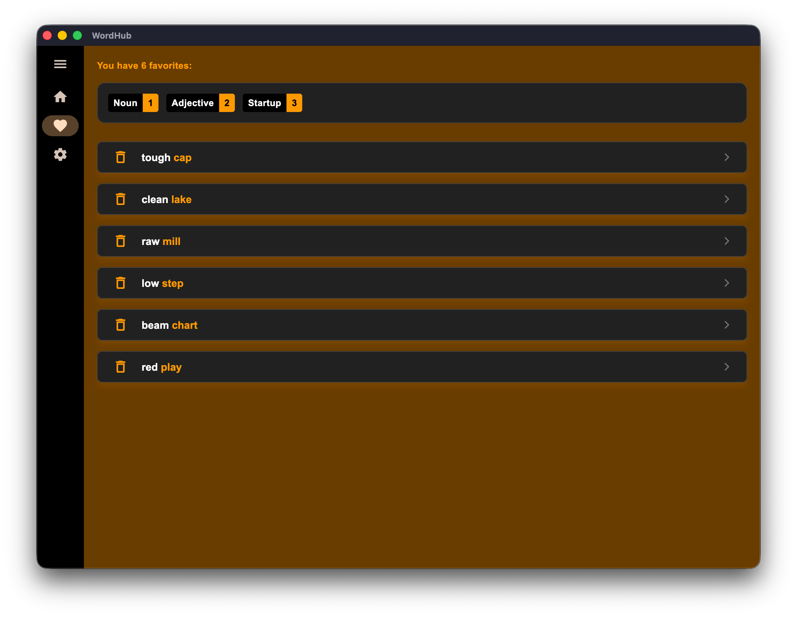
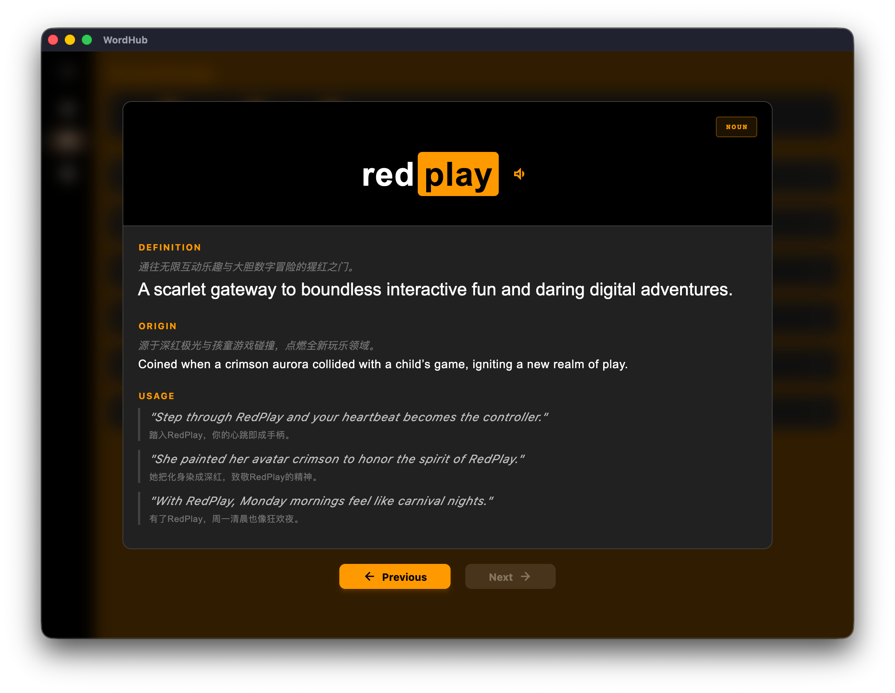
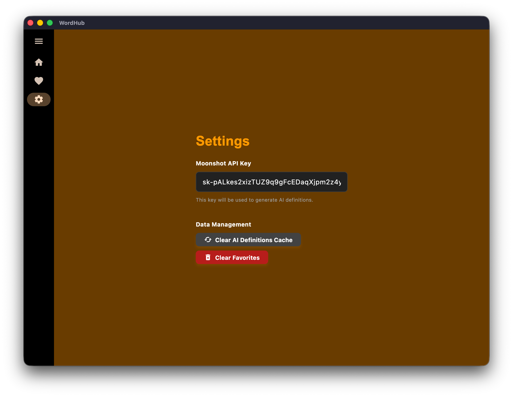

# WordHub

WordHub is a creative word discovery and learning application built with Flutter. It generates random English word pairs and uses AI to provide detailed profiles for them, including definitions, origins, and usage examples.

The application features a unique and bold UI design inspired by the Pornhub aesthetic, characterized by a dark theme with high-contrast orange accents.

## Screenshots

<div style="display: flex; gap: 10px;">
  
  
  
  
</div> src="screenshots/setting.png" alt="Settings" width="300" />
</div>

## Features

*   **Random Word Generation**: Discover new and interesting word combinations.
*   **AI-Powered Insights**: Uses Moonshot AI (LLM) to generate:
    *   Creative definitions (English & Chinese).
    *   Fictional origin stories.
    *   Part of speech tagging.
    *   Bilingual example sentences.
*   **Text-to-Speech (TTS)**: Pronounce word pairs with a single click.
*   **Favorites Management**: Save your favorite words and view detailed statistics.
*   **History Tracking**: Easily revisit recently generated words.
*   **Local Caching**: Caches AI responses locally to reduce API usage and improve performance.
*   **Responsive Design**: Optimized layout for both desktop and mobile views.

## Tech Stack

*   **Framework**: [Flutter](https://flutter.dev/) (Dart)
*   **State Management**: [Provider](https://pub.dev/packages/provider)
*   **AI Integration**: Moonshot AI API (OpenAI-compatible)
*   **HTTP Client**: `http` package
*   **Local Storage**: `path_provider` (File-based persistence)
*   **Text-to-Speech**: `flutter_tts` package
*   **UI Components**: Material 3, AnimatedList, Custom ScrollViews

## Implementation Details

*   **Architecture**: The app follows a clean architecture with separated concerns:
    *   `lib/models`: State management and business logic (`MyAppState`).
    *   `lib/pages`: Screen definitions (`GeneratorPage`, `FavoritesPage`, `SettingsPage`).
    *   `lib/widgets`: Reusable UI components (`BigCard`, `WordInfoDisplay`).
    *   `lib/services`: External service integration (`MoonshotService`).
*   **Design**: The UI heavily utilizes `Colors.black` and a custom orange (`#FFFF9900`) to replicate the iconic high-contrast style. Custom widgets like `BigCard` are designed to mimic card-based layouts with flat, bold aesthetics.
*   **AI & Caching**: To optimize costs and speed, the app checks a local JSON file cache before requesting data from the LLM. If data is missing, it fetches it asynchronously and updates the UI in real-time.

## Development

This project was developed entirely within **[Trae IDE](https://www.trae.ai/)** and implemented end-to-end using **Vibe Coding** (AI-assisted autonomous programming). 

*   **Trae IDE**: A next-generation AI-native IDE that integrates coding agents directly into the workflow.
*   **Vibe Coding**: The entire codebase, from the initial Flutter structure to the complex state management, API integration, and custom UI styling, was generated and refined through natural language interaction with the AI assistant. The user provided high-level directives (e.g., "Implement caching", "Style like Pornhub", "Fix layout bugs"), and the AI autonomously handled the file creation, code writing, debugging, and refactoring.

## Getting Started

1.  Clone the repository:
    ```bash
    git clone git@github.com:linnyh/WordHub.git
    ```
2.  Install dependencies:
    ```bash
    flutter pub get
    ```
3.  Run the app:
    ```bash
    flutter run
    ```

*Note: You will need a valid Moonshot API key to use the AI generation features. Enter it in the Settings page.*
